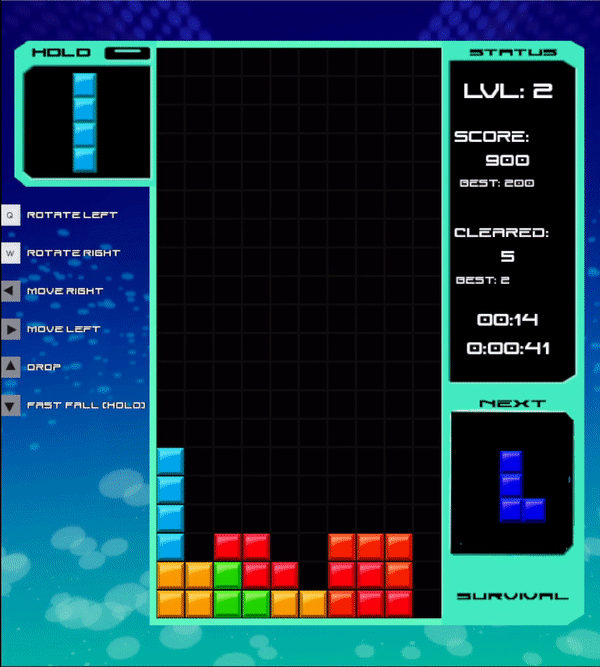

# <p align="center">**Tetris 69**</p>


### __Requirements__


- Python 3.x
- Pygame
<br></br>


### Installation

- git clone
```
git clone https://github.com/pelayo-joel/tetris.git
```


- install pygame
```
pip install pygame
```

<br></br>


## <p align="center">**Presentation**</p>
---
<div align="center">
</div>
<br></br>

<p align="center">Here's a fun Tetris 99 knock-off project entirely written in Python with the Pygame module. The game might not have a battle royal mode but instead includes 4 different modes and a training one to hone your skills in the extremely famous Tetris game !</p>
<br></br>


### **Details**
- The code is divided in 5 different files:
<br></br>

    - ``Game.py`` is the main file to run.

    - ``Tetris.py`` contains all the different classes that structures the game (ScoreManager, Game and Menu).


    - ``tetrisObj.py``  holds the different objects related to the Tetris game (Playfield, Tile, Tetromino, InGame_UI).

    - ``widgets.py`` is a file containing pygame based object that i also use for other pygame projects as well, it may change depending on my needs on certain projects (Frame, TextLabel, Button/GfxButton, Slider, GridMap).

    - ``const.py`` contains all the different constant that i use through all other files for this project.

<br></br>

- Scores are stored in ``Scores.json``. \
<br></br>


## **The Game**
---
Tetris 69 includes 4 different modes being; Classic, Marathon, Rush and Survival. Scores are saved at the end of a game and ranks you in the score board if you're top 3.<br></br>
 To get registered as a new player, simply type-in a username and a password, add yourself then play.\
 <br></br>


### Controls

- The game plays itself with the keyboard only (in the menu as well), no need for your mouse.<br></br>
- The controls are displayed during a game, training mode has a pause and a clear key being the ``ESCAPE KEY`` and ``BACKSPACE KEY`` respectively.
    - ``Q KEY`` Rotates counterclockwise.
    - ``W KEY`` Rotates clockwise.
    - ``LEFT ARROW KEY`` Move left.
    - ``RIGHT ARROW KEY`` Move right.
    - ``DOWN ARROW KEY`` Fast fall (hold).
    - ``UP ARROW KEY`` Drop.
    - ``SPACE KEY`` Hold a Tetromino.\
<br></br>


### Mechanics
- **Levels**: The game speeds up every 5 lines cleared, the game changes music at level 25 and 31, speed caps at Level 31 where it essentially becomes impossible (and sometimes buggy). <br></br>
- **Lock delay**: Like in every Tetris game, Tetrominoes have a delay when they touch the ground before eventually locking themselves in their place, this value also decreases depending on your current level ***(no lock delay at Level 31)***. \
<br></br>


### **Modes** 

#### <p align="center">***Classic***</p>

<p align="center"></p> 
<p align="center">Classic as its name implies, is the normal mode where you'll be ranked based on your score, aside from the Lvl and lock delay mechanic which are present in every mode, there is no particular feature in this one.</p>
<br></br>


#### <p align="center">***Marathon***</p>

<p align="center"></p> 
<p align="center">Marathon asks you to be quick, you have to make the highest score that you can in only 1 minute, game starts at level 25 to make things more dynamic.</p>
<br></br>


#### <p align="center">***100-Lines Rush***</p>

<p align="center"></p> 
<p align="center">In Rush mode you have to clear 100 lines the fastest way possible, game starts at level 15 forcing you to reach level 31. This mode ranks players by lines cleared and time completion, score is not considered.</p>
<br></br>


#### <p align="center">***Survival***</p>

<p align="center"></p> 
<p align="center">This mode reminds you of Tetris 99, plays the same as Classic mode but periodically adds between 1 to 4 lines to the stack. Periods between additions of lines are shortened depending on your current level.</p>
<br></br>


### <p align="center">**Conclusion**</p>
---
<p align="center">This was a very fun project to realize, wanting to be a game developer the realization of these types of projects definitely helps in understanding more about how games are working underneath the hood especially with a barebone game module such as Pygame.</p>
<p align="center">If you also want to be a game developer, I suggest that you realize a similar project to learn more about gamedev. Also, feel free to use this project however you like for your own projects.</p>
<br></br>


### **CREDITS** 

- [Pelayo Joel](https://github.com/pelayo-joel)
- [The Spriters ressource](https://www.spriters-resource.com/) for Tetris 99 sprites and SFXs
- NINTENDO
